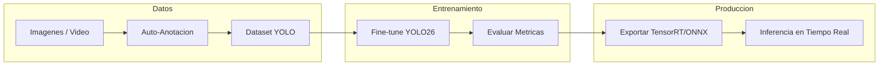

# Fine-Tuning Studio

Framework universal de fine-tuning para vision por computadora con YOLO.

Entrena, anota, evalua y despliega modelos de deteccion, segmentacion, clasificacion, pose y OBB — todo desde una interfaz web o CLI.

## Pipeline



## Tareas Soportadas

| Tarea | Modelo | Ejemplo |
|-------|--------|---------|
| Deteccion | `yolo26[n/s/m/l/x].pt` | Detectar objetos en imagenes |
| Segmentacion | `yolo26[n/s/m/l/x]-seg.pt` | Segmentar objetos a nivel de pixel |
| Clasificacion | `yolo26[n/s/m/l/x]-cls.pt` | Clasificar imagenes completas |
| Pose | `yolo26[n/s/m/l/x]-pose.pt` | Estimar poses humanas |
| OBB | `yolo26[n/s/m/l/x]-obb.pt` | Bounding boxes orientados |

## Estructura del Proyecto

```
fine-tuning/
├── app.py                       # Interfaz Gradio (Fine-Tuning Studio)
├── config.yaml                  # Configuracion de entrenamiento
├── src/                         # Modulos de logica de negocio
│   ├── inference.py             # Carga de modelos e inferencia
│   ├── training.py              # Rutinas de entrenamiento YOLO
│   ├── dataset.py               # Gestion y validacion de datasets
│   ├── benchmark.py             # Benchmarking de rendimiento
│   └── annotation.py            # Auto-anotacion y revision
├── scripts/                     # CLI entry points
│   ├── train.py                 # Entrenamiento completo
│   ├── inference.py             # Inferencia (imagen/video/webcam)
│   ├── auto_annotate.py         # Auto-anotacion template matching
│   ├── auto_annotate_grounding_dino.py  # Auto-anotacion zero-shot
│   ├── visualize_annotations.py # Visualizar anotaciones
│   ├── split_dataset.py         # Dividir train/val
│   ├── benchmark.py             # Comparar formatos
│   ├── evaluate.py              # Evaluacion del modelo
│   └── export_tensorrt.py       # Exportar a TensorRT/ONNX
├── tests/                       # Suite de tests (47 tests)
├── data/                        # Datasets (gestionados por usuario)
├── models/                      # Modelos entrenados (.pt, .onnx, .engine)
├── runs/                        # Logs de entrenamiento
└── docs/                        # Documentacion
    ├── HITOS.md                 # Roadmap y fases del proyecto
    ├── ZERO_SHOT_GUIDE.md       # Guia de auto-anotacion zero-shot
    └── archive/                 # Documentacion historica (VR project)
```

## Instalacion

```bash
# Clonar
git clone https://github.com/robertteleng/fine-tuning.git
cd fine-tuning

# Entorno virtual
python3 -m venv .venv
source .venv/bin/activate

# Dependencias
pip install -r requirements.txt

# Verificar GPU
python -c "import torch; print(f'CUDA: {torch.cuda.is_available()}, GPU: {torch.cuda.get_device_name(0)}')"
```

## Uso

### Interfaz Web (Gradio)

```bash
python app.py
# Abre http://localhost:7860
```

7 tabs: Inference, Metrics, Training, Auto-Annotate, Dataset, Annotations, Info.

### CLI

```bash
# Entrenamiento
python scripts/train.py

# Inferencia
python scripts/inference.py --source imagen.jpg
python scripts/inference.py --source video.mp4
python scripts/inference.py --source 0 --show  # webcam

# Auto-anotacion zero-shot
python scripts/auto_annotate_grounding_dino.py \
  --source data/frames/ \
  --prompt "your object description" \
  --output data/dataset/

# Exportar a TensorRT
python scripts/export_tensorrt.py --format engine --half

# Benchmark
python scripts/benchmark.py
```

## Configuracion

Edita `config.yaml` para ajustar hiperparametros:

```yaml
model: "yolo26m.pt"    # Modelo base
batch: -1              # Auto-detect segun VRAM
workers: 8             # Workers del DataLoader
imgsz: 640             # Tamano de entrada
epochs: 100            # Epocas de entrenamiento
patience: 20           # Early stopping
amp: true              # Mixed precision
cache: "ram"           # Cacheo en RAM
```

La GPU se auto-detecta y los defaults se ajustan automaticamente.

## Stack Tecnico

- **Modelo:** YOLO26 (Ultralytics >=8.4.14) — NMS-free, end-to-end
- **Framework:** PyTorch + Ultralytics
- **UI:** Gradio
- **Anotacion:** Template Matching + Grounding DINO (zero-shot)
- **Export:** TensorRT FP16, ONNX
- **Testing:** pytest (47 tests)

## Historial del Proyecto

Este proyecto evoluciono desde un detector especifico de objetos VR (YOLOv12s) a un framework universal de fine-tuning. La documentacion historica se encuentra en [docs/archive/](docs/archive/).

## Referencias

- [Ultralytics YOLO](https://docs.ultralytics.com/)
- [YOLO26](https://docs.ultralytics.com/models/yolo26/)
- [Grounding DINO](https://github.com/IDEA-Research/GroundingDINO)
- [makesense.ai](https://www.makesense.ai/) — Anotacion web gratuita

---

*Ultima actualizacion: Febrero 2026*
