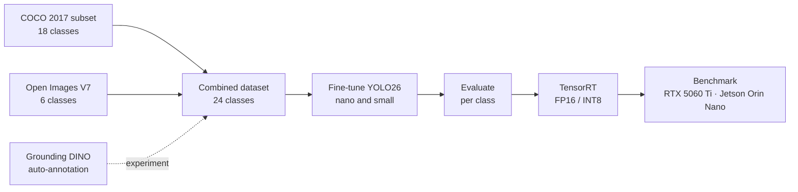

# Vision Fine-Tuning · navigation obstacle detector

A reproducible pipeline for a **24-class obstacle detector for blind and low-vision pedestrians**,
from dataset to edge deployment: build the data, fine-tune **YOLO26** nano and small, score them
per class, export to **TensorRT FP16/INT8** and benchmark on an **RTX 5060 Ti** and a **Jetson Orin Nano**.

It is the perception model behind AriaGuard, an assistive navigation system for Meta Aria smart
glasses (*Real-Time GPU-Accelerated Assistive Navigation Using Meta Aria Smart Glasses*,
IWINAC 2026, Springer LNCS 16575, pp. 128–137).

📖 **How it was built** (ES/EN): [robertteleng.github.io/vision-fine-tuning](https://robertteleng.github.io/vision-fine-tuning/)

## Results

Every number below is generated by `scripts/make_tables.py` from the JSON records in
[`benchmarks/results/`](benchmarks/results/), under the protocol in
[docs/BENCHMARK_METHODOLOGY.md](docs/BENCHMARK_METHODOLOGY.md). Accuracy is on the full
validation split (2,571 images); latency is end to end over 500 validation images, batch 1.

<!-- BENCHMARK:START -->
| Device | Model | Precision | Mean ms | p95 ms | FPS | Engine ms | Size MB | mAP50 | mAP50-95 | Stairs | Door | person |
|---|---|---|---|---|---|---|---|---|---|---|---|---|
| Jetson Orin | yolo26n_nav | FP32 | 35.15 | 36.42 | 28 | — | 5.1 | 0.396 | 0.261 | 0.317 | 0.365 | 0.661 |
| Jetson Orin | yolo26n_nav | FP16 | 22.89 | 29.97 | 44 | 4.06 | 8.1 | 0.394 | 0.258 | 0.225 | 0.358 | 0.662 |
| Jetson Orin | yolo26n_nav | INT8 | build failed (TensorRT 10.3.0) | — | — | — | — | — | — | — | — | — |
| Jetson Orin | yolo26n_nav | INT8_QDQ | 23.63 | 30.50 | 42 | 4.35 | 4.2 | 0.371 | 0.240 | 0.265 | 0.351 | 0.651 |
| Jetson Orin | yolo26s_nav | FP32 | 34.25 | 35.97 | 29 | — | 19.4 | 0.471 | 0.311 | 0.333 | 0.406 | 0.737 |
| Jetson Orin | yolo26s_nav | FP16 | 23.32 | 31.64 | 43 | 6.67 | 21.6 | 0.463 | 0.305 | 0.391 | 0.381 | 0.732 |
| Jetson Orin | yolo26s_nav | INT8 | build failed (TensorRT 10.3.0) | — | — | — | — | — | — | — | — | — |
| Jetson Orin | yolo26s_nav | INT8_QDQ | 25.22 | 34.82 | 40 | 5.10 | 11.0 | 0.400 | 0.263 | 0.186 | 0.320 | 0.678 |
| NVIDIA GeForce RTX 5060 Ti | yolo26n_nav | FP32 | 8.11 | 8.58 | 123 | — | 5.1 | 0.396 | 0.261 | 0.316 | 0.365 | 0.661 |
| NVIDIA GeForce RTX 5060 Ti | yolo26n_nav | FP16 | 1.87 | 2.43 | 535 | 0.62 | 6.7 | 0.394 | 0.257 | 0.225 | 0.359 | 0.662 |
| NVIDIA GeForce RTX 5060 Ti | yolo26n_nav | INT8 | 2.07 | 2.53 | 483 | 0.84 | 10.0 | 0.376 | 0.236 | 0.240 | 0.335 | 0.647 |
| NVIDIA GeForce RTX 5060 Ti | yolo26n_nav | INT8_QDQ | build failed (TensorRT 10.16.1.11) | — | — | — | — | — | — | — | — | — |
| NVIDIA GeForce RTX 5060 Ti | yolo26s_nav | FP32 | 8.41 | 8.79 | 119 | — | 19.4 | 0.471 | 0.311 | 0.333 | 0.407 | 0.737 |
| NVIDIA GeForce RTX 5060 Ti | yolo26s_nav | FP16 | 2.35 | 2.83 | 426 | 1.06 | 20.5 | 0.463 | 0.305 | 0.385 | 0.383 | 0.732 |
| NVIDIA GeForce RTX 5060 Ti | yolo26s_nav | INT8 | 2.56 | 3.07 | 391 | 1.21 | 16.3 | 0.415 | 0.264 | 0.311 | 0.336 | 0.695 |
| NVIDIA GeForce RTX 5060 Ti | yolo26s_nav | INT8_QDQ | build failed (TensorRT 10.16.1.11) | — | — | — | — | — | — | — | — | — |

INT8 criterion (fixed on 2026-09-16, before measuring): p95 at least 20% lower, mAP50 drop at most 0.01, Stairs mAP50 drop at most 0.02.

- **Jetson Orin · yolo26n_nav · INT8**: engine could not be built
- **Jetson Orin · yolo26n_nav · INT8_QDQ**: keep FP16 (p95_latency_reduction -0.018 ✗, map50_drop +0.024 ✗, stairs_map50_drop -0.040 ✓)
- **Jetson Orin · yolo26s_nav · INT8**: engine could not be built
- **Jetson Orin · yolo26s_nav · INT8_QDQ**: keep FP16 (p95_latency_reduction -0.100 ✗, map50_drop +0.062 ✗, stairs_map50_drop +0.205 ✗)
- **NVIDIA GeForce RTX 5060 Ti · yolo26n_nav · INT8**: keep FP16 (p95_latency_reduction -0.039 ✗, map50_drop +0.018 ✗, stairs_map50_drop -0.016 ✓)
- **NVIDIA GeForce RTX 5060 Ti · yolo26n_nav · INT8_QDQ**: engine could not be built
- **NVIDIA GeForce RTX 5060 Ti · yolo26s_nav · INT8**: keep FP16 (p95_latency_reduction -0.084 ✗, map50_drop +0.047 ✗, stairs_map50_drop +0.074 ✗)
- **NVIDIA GeForce RTX 5060 Ti · yolo26s_nav · INT8_QDQ**: engine could not be built
<!-- BENCHMARK:END -->

<!-- FINDINGS:START -->
### What the numbers say

1. **FP16 is the deployment choice on both devices.** On the RTX 5060 Ti it is 4.3× (nano) and 3.6×
   (small) faster than PyTorch FP32 end to end, for a mAP50 drop of 0.002 and 0.008. No INT8 variant met the INT8 criterion, which was
   written down before any measurement.
2. **On the Jetson, the model is not the bottleneck.** The FP16 engines take **4.1 ms** (nano) and
   **6.7 ms** (small) on their own, yet end to end both take **~23 ms**: CPU pre-processing and the
   Python pipeline cost 4.6× (nano) and 2.5× (small) what the network does. That is why nano and small look equally fast
   there, and why a faster engine does not show up end to end.
3. **INT8 does not earn its place here.**
   - Ultralytics' implicit INT8 cannot be built on TensorRT 10.3 (Jetson). On the RTX it builds, but
     it is slower than FP16, because unquantized layers fall back to FP32.
   - Explicit Q/DQ INT8 (NVIDIA ModelOpt) builds on the Jetson and halves engine size, but brings no
     end-to-end gain. The small model loses 0.063 mAP50 and 0.205 `Stairs` mAP50.
   - On the RTX, a TensorRT 10.16 bug blocks the same Q/DQ file.
4. **Look per class, not only at global mAP.** Converting nano to FP16 costs 0.002 global mAP50 but
   drops `Stairs` from 0.316–0.317 to 0.225. It happens identically on both devices, so it is the conversion,
   not noise from one machine.
5. **Accuracy matches across devices** at every precision, a sanity check on the protocol.
<!-- FINDINGS:END -->

## Pipeline



| Step | What | Command |
|---|---|---|
| 1 · Data | Rebuild the exact dataset from pinned image IDs | `scripts/build_dataset.py` |
| 2 · Auto-annotate | Grounding DINO labels from a text prompt, scored against human labels | `scripts/experiment_stairs.py` |
| 3 · Train | Same recipe for nano and small (`config.yaml`) | `scripts/train.py` |
| 4 · Evaluate | Global and per-class mAP | `scripts/evaluate.py` |
| 5 · Export | TensorRT engine built on the target device | `scripts/export_tensorrt.py` |
| 6 · Benchmark | Accuracy and latency, one JSON record per run | `scripts/benchmark.py` |

**Why a combined dataset.** Fine-tuning replaces the YOLO detection head. A model trained only on
the new classes forgets the COCO ones, so every class the detector needs has to be in one dataset,
with non-overlapping IDs: 18 COCO classes (IDs 0-17) and 6 Open Images V7 classes COCO lacks
(`Door`, `Stairs`, `Street light`, `Traffic sign`, `Tree`, `Wheelchair`, IDs 18-23).

## Dataset

| Split | COCO 2017 | Open Images V7 | Total |
|---|---|---|---|
| train | 8,000 | 3,608 | 11,608 |
| val | 2,000 | 571 | 2,571 |

The images are pinned by ID in [`data_manifest/`](data_manifest/). Labels are converted from the
upstream annotation files, so `build_dataset.py` reproduces the training set exactly: identical
labels for all 14,179 images, and byte-identical images in a 600-image sample.

## Experiment: can auto-annotation fix `Stairs`?

`Stairs` matters most to a blind pedestrian and is one of the weakest classes. The experiment
compares three nano models: baseline, plus 1,000 stairs images labelled by **Grounding DINO**,
plus the same images with **human** labels. It measures how much of the gain from more data
zero-shot labels capture. Design and decision criterion were committed before any run:
[docs/EXPERIMENT_STAIRS.md](docs/EXPERIMENT_STAIRS.md).

<!-- EXPERIMENT:START -->
| Arm (nano) | `Stairs` AP50, test set (140 instances) | Global mAP50, val |
|---|---|---|
| Baseline | 0.464 | 0.396 |
| + 1,000 images labelled by Grounding DINO | 0.543 (+0.079) | 0.398 |
| + the same images, human labels | **0.590** (+0.126) | **0.411** |

**Auto-annotation captured 63 % of the human-label gain** without hurting other classes, which passes
the pre-registered bar of 50 %. Against the human boxes the pseudo-labels have precision 0.59 and
recall 0.72, yet the two arms are within 0.005 at AP50-95. The auto boxes are tight; what costs is
spurious and missed stairs. One seed per arm and Open Images photos rather than egocentric video:
see the limits in the experiment document.
<!-- EXPERIMENT:END -->

## Limitations

- **Research prototype, not a certified assistive device.** Missing an obstacle can hurt someone.
- **Modest accuracy and imbalanced classes.** `Street light` has 40 validation instances in 7
  images, and `Stairs` 45 in 36. Their mAP is noisy.
- **Partial labels.** Open Images images do not label people or cars with the COCO classes, and
  COCO images do not label doors or stairs. Training treats those objects as background.
- **Photos, not egocentric video.** Both sources are mostly third-person photos. The glasses see
  the world from head height while walking.
- **Nano may be undertrained.** Its best epoch was the last of 50.

## Install

Requires [uv](https://docs.astral.sh/uv/) and an NVIDIA GPU with CUDA (x86_64 Linux). On a Jetson,
use the container in `scripts/jetson/benchmark.sh`.

```bash
git clone https://github.com/robertteleng/vision-fine-tuning.git
cd vision-fine-tuning
uv sync --extra dev           # core + tests (+ Grounding DINO)
uv sync --extra datasets      # + FiftyOne, to build the dataset
uv sync --extra export        # + ONNX and TensorRT, to export and benchmark
```

## Usage

```bash
uv run python scripts/build_dataset.py --out data/nav_combined --download
uv run python scripts/train.py --model yolo26n.pt --data data/nav_combined/dataset.yaml
uv run python scripts/benchmark.py --weights models/yolo26n_nav.pt models/yolo26s_nav.pt
uv run python scripts/make_tables.py --readme

uv run python app.py          # Gradio demo: image and video inference, http://localhost:7860
uv run pytest                 # dataset tests skip themselves when data/ is absent
```

## Layout

```
app.py              Gradio demo
config.yaml         Training recipe
data_manifest/      Pinned image IDs (training set and experiment)
src/                nav_dataset · edge_bench · trt_export · stairs_experiment · inference · training · hardware
scripts/            build_dataset, train, evaluate, export_tensorrt, benchmark, make_tables, experiment_stairs, jetson/
benchmarks/         JSON records: benchmarks, training summaries, experiment
models/             yolo26n_nav.pt, yolo26s_nav.pt
docs/               Methodology, experiment, training notes, INT8 lab, explainer site
tests/              pytest
```

## Future work

- **A faster pipeline before a faster model.** Letterbox and normalization on the GPU and a C++
  TensorRT runtime would attack the ~19 ms of CPU time per frame on the Jetson.
- **INT8 that keeps accuracy.** Mixed precision (detection head in FP16) or quantization-aware
  training. It is only worth it once the engine dominates latency.
- **JetPack 7.2.1 (TensorRT 10.16) on the Jetson:** re-run the same benchmark.
- **An egocentric test set** from open Aria recordings, to measure the detector from head height while walking.
- **Longer training for nano**, whose best epoch was the last of 50.

## Documentation

- [Benchmark methodology](docs/BENCHMARK_METHODOLOGY.md)
- [Stairs auto-annotation experiment](docs/EXPERIMENT_STAIRS.md), pre-registered
- [Training process and the combined dataset](docs/TRAINING_PROCESS.md) (Spanish)
- [Lab: FP32 → FP16 → INT8](docs/LAB_FP16_INT8.md), a learning exercise (Spanish)

## Stack

YOLO26 (Ultralytics 8.4.14) · PyTorch · TensorRT · ONNX · Grounding DINO (transformers) · FiftyOne · Gradio · uv · pytest
