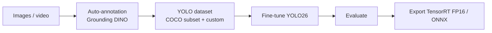

# Vision Fine-Tuning

A small framework to fine-tune **YOLO26** (Ultralytics) models end to end: auto-annotate, train, evaluate and export to TensorRT, from a Gradio UI or the CLI.

It was built for a real use case: a **24-class obstacle detector for assisted navigation** for blind and low-vision pedestrians, used in AriaGuard.

📖 **How it was built** (ES/EN): [robertteleng.github.io/vision-fine-tuning](https://robertteleng.github.io/vision-fine-tuning/)

## Results

Model `yolo26s_nav.pt`: YOLO26s trained on 14K images (18 COCO classes + 6 custom classes from Open Images V7).

| Metric | Value |
|---|---|
| mAP50 / mAP50-95 | 0.470 / 0.311 (best epoch 37 of 50) |
| Precision / Recall | 0.558 / 0.462 |
| TensorRT FP16 | **451 FPS** (2.21 ms/frame), RTX 5060 Ti |

**Limitations.** Accuracy is modest and classes are imbalanced. `Stairs`, which matters most for the product, reaches 0.318. `Street light` scores 0.044 with only 7 validation images, so that number is not reliable. Next steps are listed in [docs/TRAINING_PROCESS.md](docs/TRAINING_PROCESS.md#mejoras-pendientes).

## How it works



**Key decision.** Training YOLO replaces the whole detection head, so you cannot add classes to a COCO model without it forgetting the original ones. The approach here is a **combined dataset**: a COCO subset with only the relevant classes, plus the new classes with remapped IDs. Details in [docs/TRAINING_PROCESS.md](docs/TRAINING_PROCESS.md).


## Install

Requires [uv](https://docs.astral.sh/uv/) and an NVIDIA GPU with CUDA.

```bash
git clone https://github.com/robertteleng/vision-fine-tuning.git
cd vision-fine-tuning
uv sync                      # core
uv sync --extra annotation   # + Grounding DINO
uv sync --extra datasets     # + FiftyOne / Roboflow
uv sync --extra dev          # + pytest
```

## Usage

```bash
# Web UI: Inference, Metrics, Training, Auto-Annotate, Dataset, Annotations, Info
uv run python app.py                                   # http://localhost:7860

# CLI
uv run python scripts/train.py -m yolo26s.pt -e 50
uv run python scripts/inference.py --source video.mp4
uv run python scripts/auto_annotate_grounding_dino.py --source data/frames/ --prompt "door" --output data/dataset/
uv run python scripts/export_tensorrt.py --format engine --half
uv run python scripts/benchmark.py

# Tests (dataset tests skip themselves when data/ is absent)
uv run pytest
```

Hyperparameters live in [`config.yaml`](config.yaml). The GPU is detected automatically and `batch: -1` sizes the batch to the available VRAM.

## Layout

```
app.py            Gradio UI
config.yaml       Training hyperparameters
src/              Core logic: hardware, project, training, inference, dataset, annotation, benchmark
scripts/          CLI: train, inference, evaluate, benchmark, export_tensorrt,
                  auto_annotate(_grounding_dino), review/visualize_annotations, split_dataset
tests/            pytest
models/           yolo26s_nav.pt (trained model)
docs/             Guides (Spanish) and the explainer site (index.html)
```

## Docs (Spanish)

- [Training process and combined dataset](docs/TRAINING_PROCESS.md)
- [Step-by-step guides](docs/learning/README.md): pipeline, model choice, TensorRT, benchmark

## Stack

YOLO26 (Ultralytics ≥ 8.4.14) · PyTorch · Grounding DINO (transformers) · TensorRT · Gradio · FiftyOne · uv · pytest
