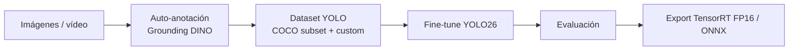

# Vision Fine-Tuning

Framework para hacer fine-tuning de modelos **YOLO26** (Ultralytics): auto-anotar, entrenar, evaluar y exportar a TensorRT, desde una interfaz Gradio o por CLI.

Nació para un caso real: un detector de obstáculos de **24 clases para navegación asistida** de personas ciegas, usado en AriaGuard.

## Resultados

Modelo `yolo26s_nav.pt`: YOLO26s entrenado con 14K imágenes (18 clases de COCO + 6 clases propias de Open Images V7).

| Métrica | Valor |
|---|---|
| mAP50 / mAP50-95 | 0.470 / 0.311 (mejor época 37 de 50) |
| Precision / Recall | 0.558 / 0.462 |
| TensorRT FP16 | **451 FPS** (2.21 ms/frame), RTX 5060 Ti |

**Límites.** El mAP es modesto y las clases están desbalanceadas. `Stairs`, crítica para el producto, se queda en 0.318. `Street light` saca 0.044 con solo 7 imágenes de validación, así que esa métrica no es fiable. Las mejoras pendientes están en [docs/TRAINING_PROCESS.md](docs/TRAINING_PROCESS.md#mejoras-pendientes).

## Cómo funciona



**Decisión clave.** YOLO reemplaza la cabeza de detección completa al entrenar, así que no se pueden añadir clases a un modelo COCO sin que olvide las originales. La solución es un **dataset combinado**: un subset de COCO con las clases relevantes más las clases nuevas con los IDs remapeados. Está explicado en detalle en [docs/TRAINING_PROCESS.md](docs/TRAINING_PROCESS.md).

Tareas soportadas: detección, segmentación, clasificación, pose y OBB (`yolo26[n/s/m/l/x]`).

## Instalación

Requiere [uv](https://docs.astral.sh/uv/) y una GPU NVIDIA con CUDA.

```bash
git clone https://github.com/robertteleng/vision-fine-tuning.git
cd vision-fine-tuning
uv sync                      # core
uv sync --extra annotation   # + Grounding DINO
uv sync --extra datasets     # + FiftyOne / Roboflow
uv sync --extra dev          # + pytest
```

## Uso

```bash
# Interfaz web: Inference, Metrics, Training, Auto-Annotate, Dataset, Annotations, Info
uv run python app.py                                   # http://localhost:7860

# CLI
uv run python scripts/train.py -m yolo26s.pt -e 50
uv run python scripts/inference.py --source video.mp4
uv run python scripts/auto_annotate_grounding_dino.py --source data/frames/ --prompt "door" --output data/dataset/
uv run python scripts/export_tensorrt.py --format engine --half
uv run python scripts/benchmark.py

# Tests (los que dependen de data/ se saltan si no hay dataset)
uv run pytest
```

Los hiperparámetros están en [`config.yaml`](config.yaml). La GPU se detecta automáticamente y `batch: -1` ajusta el batch a la VRAM disponible.

## Estructura

```
app.py            Interfaz Gradio
config.yaml       Hiperparámetros de entrenamiento
src/              Lógica: hardware, project, training, inference, dataset, annotation, benchmark
scripts/          CLI: train, inference, evaluate, benchmark, export_tensorrt,
                  auto_annotate(_grounding_dino), review/visualize_annotations, split_dataset
tests/            pytest
models/           yolo26s_nav.pt (modelo entrenado)
docs/             Guías (ver abajo)
```

## Documentación

- [Proceso de entrenamiento y dataset combinado](docs/TRAINING_PROCESS.md)
- [Guía de auto-anotación zero-shot](docs/ZERO_SHOT_GUIDE.md)
- [Guías paso a paso](docs/learning/README.md): pipeline, elección de modelo, TensorRT, benchmark
- [docs/archive/](docs/archive/): origen del proyecto como detector de objetos VR (YOLOv12s)

## Stack

YOLO26 (Ultralytics ≥ 8.4.14) · PyTorch · Grounding DINO (transformers) · TensorRT · Gradio · FiftyOne · uv · pytest
